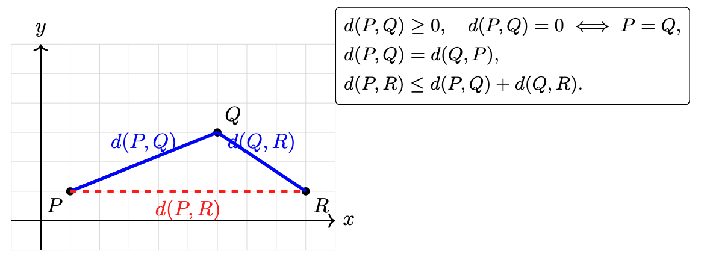

## Table of Contents

1. [Learning Objectives](#learning-objectives)
2. [Clustering Overview](#clustering-overview)
3. [Hierarchical Clustering](#hierarchical-clustering)
    - [Agglomerative (Bottom‑Up)](#agglomerative-bottomup)
    - [Divisive (Top‑Down)](#divisive-topdown)
    - [Dendrogram](#dendrogram)
    - [Practical](#practical)
4. [K‑Means Clustering](#k-means-clustering)
    - [Algorithm Steps](#algorithm-steps)
    - [Pseudocode](#pseudocode)
    - [Pros & Cons](#pros--cons)
5. [Choosing Between Methods](#choosing-between-methods)
    - [Hierarchical Clustering](#hierarchical-clustering-1)
    - [K‑Means](#k-means)
6. [Summary](#summary)
7. [References & Further Reading](#references--further-reading)


## Learning Objectives

By the end of this lesson, students will be able to:

1. **Explain the goal and applications of clustering**  
   - Define unsupervised learning and distinguish clustering from classification.  
   - Cite real‑world uses (e.g., customer segmentation, anomaly detection).

2. **Describe and execute hierarchical clustering methods**  
   - Differentiate agglomerative (bottom‑up) vs. divisive (top‑down) approaches.  
   - Compute and interpret a dendrogram.  
   - Apply various linkage criteria (single, complete, average, Ward’s, etc.) and distance metrics (Euclidean, Manhattan, cosine).

3. **Implement and analyze K‑Means clustering**  
   - Articulate the iterative assignment–update steps and convergence conditions.  
   - Write or follow pseudocode for K‑Means, including centroid initialization strategies (random vs. k‑means++).  
   - Compute and interpret the within‑cluster variation objective.

4. **Compare clustering techniques and select appropriately**  
   - Identify strengths and weaknesses of hierarchical vs. K‑Means approaches.  
   - Choose between methods based on data characteristics (number of clusters, scalability, hierarchy needs).

---


## Clustering Overview

Clustering is an **unsupervised learning** technique used to group similar data points together. Unlike classification, there are no pre-defined labels. Instead, the algorithm tries to discover structure in the data by maximizing intra-cluster similarity and minimizing inter-cluster similarity.

**Key points:**
- **Objective:** Identify natural groupings in the data.  
- **Applications:** Customer segmentation, image compression, anomaly detection, document clustering.

---

## Hierarchical Clustering

Hierarchical clustering builds a tree (dendrogram) of clusters using either a **bottom‑up** (agglomerative) or **top‑down** (divisive) approach.

### Agglomerative (Bottom‑Up)

1. **Initialization:** Start with each data point as its own cluster.  
2. **Merge Steps:**  
   - Compute distance between every pair of clusters.  
   - Merge the two closest clusters.  
   - Update the distance matrix.  
3. **Termination:** Repeat until all points are in a single cluster or a stopping criterion (e.g., desired number of clusters) is met.

### Divisive (Top‑Down)

1. **Initialization:** Start with all data points in one cluster.  
2. **Split Steps:**  
   - Choose a cluster to split (e.g., the one with highest variance).  
   - Partition it into two sub-clusters using a simple method (e.g., k‑means with k=2).  
3. **Termination:** Continue splitting until each point is its own cluster or the desired number of clusters is reached.

### Dendrogram

```text
        [ALL POINTS]
         /      \
    Cluster A   Cluster B
     /    \       /    \
    …      …     …      …
```


- **Cutting the tree** at different levels yields different numbers of clusters.
- **Linkage methods** determine how distance between clusters is computed:
  - **Single linkage:** Minimum pairwise distance  
  - **Complete linkage:** Maximum pairwise distance  
  - **Average linkage:** Average pairwise distance  

### Important Concepts


- **Metric**  
  The *metric* (or distance function or dissimilarity function) defines how you measure the distance between individual data points. Common choices include Euclidean, Manhattan (cityblock), or cosine distance. This metric determines the “raw” pairwise distances.

*Euclidean distance*



*Manhattan distance*


- **Linkage**  
  The *linkage* method defines how to compute the distance between two clusters based on the pairwise distances of their members. Examples:  
  - **Single**: the distance between the closest pair of points (one from each cluster).  
  - **Complete**: the distance between the farthest pair of points.  
  - **Average**: the average of all pairwise distances.  
  - **Ward**: the merge that minimizes the increase in total within‑cluster variance.  

*Linkage function*


| Linkage Method        | How It Works                                                                                     | Intuition                                                                                       |
|-----------------------|--------------------------------------------------------------------------------------------------|-------------------------------------------------------------------------------------------------|
| **Single**            | Distance = minimum pairwise distance between points in the two clusters                         | “Friends‑of‑friends” – clusters join if any two points are close, yielding chain‑like clusters  |
| **Complete**          | Distance = maximum pairwise distance between points in the two clusters                         | “Everyone must be close” – only merge when all points are relatively near, producing compact clusters |
| **Average (UPGMA)**   | Distance = average of all pairwise distances between points in the two clusters                 | Balances single and complete by averaging close and far pairs                                  |
| **Weighted (WPGMA)**  | Distance = average of the previous cluster’s distance to the new cluster (equal weight per cluster) | Prevents large clusters from dominating, giving equal say to each cluster                      |
| **Centroid**          | Distance = distance between the centroids (mean vectors) of the two clusters                    | Merges based on “centers of mass,” but centroids can shift non‑monotonically                   |
| **Median (WPGMC)**    | Distance = distance between the medians of the two clusters                                      | More robust to outliers than centroid linkage, but can also invert dendrogram order            |
| **Ward’s**            | Merge that minimizes the increase in total within‑cluster sum of squares (variance)             | Keeps clusters as tight and homogeneous as possible, often resulting in evenly sized groups     |


### Single Linkage
- **How it works**: Measures the distance between two clusters as the smallest distance between any single point in one cluster and any single point in the other.  
- **Intuition**: “Friends‑of‑friends” clustering—if any two points (one from each cluster) are close, the clusters join. Can produce long, straggly chains of points.

### Complete Linkage
- **How it works**: Measures the distance between two clusters as the largest distance between any point in one cluster and any point in the other.  
- **Intuition**: “Everyone must be close”—clusters merge only when all their points are relatively near each other, leading to tight, compact groups.

### Average Linkage (UPGMA)
- **How it works**: Takes the average of all pairwise distances between points in the two clusters.  
- **Intuition**: A middle‑ground between single and complete linkage—balances the effect of very close and very far pairs by averaging them.

### Weighted Linkage (WPGMA)
- **How it works**: Similar to average linkage, but treats each cluster as a single entity by averaging the distance from each original cluster to the target cluster, regardless of cluster size.  
- **Intuition**: Prevents larger clusters from dominating the average—gives each cluster equal say in how far apart they are.

### Centroid Linkage
- **How it works**: Computes the distance between the centroids (mean vectors) of the two clusters.  
- **Intuition**: Clusters merge based on whether their “centers of mass” are close. Can sometimes lead to non‑monotonic merges if centroids shift oddly.

### Median Linkage (WPGMC)
- **How it works**: Uses the median point of each cluster instead of the mean when computing distance between clusters.  
- **Intuition**: Like centroid linkage but more robust to outliers, since the median isn’t pulled by extreme values—though can also cause inversion issues.

### Ward’s Method
- **How it works**: At each step, merges the two clusters whose union leads to the smallest possible increase in total within‑cluster variance (sum of squared deviations).  
- **Intuition**: Always chooses the merge that keeps clusters as tight and homogeneous as possible, often yielding groups of similar size and shape.


---

#### Practical

[Hierarchical Clustering in Python](https://github.com/neelsoumya/python_machine_learning/blob/main/hierarchical_clustering_python.ipynb)


## K‑Means Clustering

K‑Means is a **partitional** clustering algorithm that aims to partition the data into **K** disjoint clusters.

### Algorithm Steps

1. **Choose K**, the number of clusters.  
2. **Initialization:** Randomly select K initial centroids (or use k‑means++ for better seeding).  
3. **Assignment Step:**  
   ```pseudo
   for each data point x_i:
       assign x_i to cluster j whose centroid μ_j is nearest (minimize ||x_i - μ_j||²)
   ```
4. **Update Step:**
   ```pseudo
   for each cluster j:
       μ_j = (1 / |C_j|) * sum_{x_i in C_j} x_i
   ```
5. **Convergence Check:**
   - Stop when assignments no longer change, OR
   - The change in centroids is below a threshold, OR
   - A maximum number of iterations is reached.

#### Pseudocode

```pseudo
function KMeans(X, K, max_iters):
    # X: dataset of n points
    # K: desired number of clusters
    # max_iters: max number of iterations

    # 1. Initialize centroids μ randomly from X
    μ = initialize_centroids(X, K)

    for t in 1…max_iters:
        # 2. Assignment step
        for i in 1…n:
            cluster[i] = argmin_j ||X[i] - μ[j]||²

        # 3. Update step
        for j in 1…K:
            μ[j] = mean of all X[i] assigned to cluster j

        # 4. Check for convergence
        if centroids did not change:
            break

    return cluster, μ
```

### Animation


<!-- created using kmeans_movie.py and kmeans_animation.ipynb -->

---


<!--
If you’re authoring for a site you control,
make sure you have MathJax loaded in the page’s <head>:
-->
<script>
window.MathJax = {
  tex: {
    inlineMath: [['$', '$'], ['\\(', '\\)']]
  }
};
</script>
<script async src="https://cdn.jsdelivr.net/npm/mathjax@3/es5/tex-mml-chtml.js"></script>


### Within–Cluster Variation

In **$K$**‑means clustering, we partition our $n$ observations into $K$ disjoint clusters
$\{C_1, C_2, \dots, C_K\}$.  A “good” clustering is one for which the _within‑cluster variation_ is minimized.

---

### Objective

Let

$$ W(C_k) $$

be our measure of cluster‐$k$’s internal variation.  Then the $K$‑means objective is

$$
\min_{C_1,\dots,C_K}
\;\sum_{k=1}^{K} W(C_k).
$$

> _In words_: partition the data into $K$ clusters so the **total** within‐cluster variation is as small as possible.

---

### Defining $W(C_k)$

By far the most common choice is **squared Euclidean distance**.  If $C_k$ contains $|C_k|$ points
$\{x_i\}_{i\in C_k}\subset\mathbb R^p$, define

$$
W(C_k)
=
\frac{1}{|C_k|}
\sum_{\,i,i'\in C_k}
\sum_{\,j=1}^{p}
\bigl(x_{ij} - x_{i'j}\bigr)^{2}.
$$

Here:

- $|C_k|$ is the number of points in cluster $k$.  
- $x_{ij}$ is the $j$th coordinate of observation $i$.  
- We sum over all pairs of observations in $C_k$, and over all feature‐indices $j=1,\dots,p$.

Putting things together, the full optimization becomes:

$$
\min_{C_1,\dots,C_K}
\sum_{k=1}^{K}
\frac{1}{|C_k|}
\sum_{\,i,i'\in C_k}
\sum_{\,j=1}^{p}
\bigl(x_{ij} - x_{i'j}\bigr)^{2}.
$$

### Elbow point

When using **k‑means clustering**, one of the key questions is: how many clusters (k) should I choose? The **elbow method** is a simple, visual way to pick a reasonable _k_ by looking at how the “within‑cluster” variation decreases as _k_ increases.

---

#### 1. The Within‑Cluster Sum of Squares (WCSS)

For each choice of _k_, you run k‑means and compute the **within‑cluster sum of squares** (WCSS), also called _inertia_ or _distortion_. This is the sum of squared Euclidean distances between each point and the centroid of its cluster:

¡[WCSS](images/wcss_equation.png)

<!--
\[
\text{WCSS}(k) = \sum_{i=1}^{k} \sum_{x \in C_i} \lVert x - \mu_i \rVert^2
\]
-->

- \(C_i\) is cluster _i_  
- \(\mu_i\) is the centroid of cluster _i_  

As _k_ increases, WCSS will always decrease (or stay the same), because more centroids can only reduce distances.

---

#### 2. Plotting WCSS versus _k_

1. **Choose a range** for _k_ (e.g. 1 to 10).  
2. **For each _k_**, fit k‑means and record `WCSS(k)`.  
3. **Plot** `WCSS(k)` on the _y_-axis against _k_ on the _x_-axis.  

You will get a curve that starts high at _k_ = 1 and steadily goes down as _k_ increases.

---

#### 3. Identifying the “Elbow”

- At first, adding clusters dramatically reduces WCSS, because you are splitting large, heterogeneous clusters into more homogeneous groups.  
- After some point, adding more clusters yields **diminishing returns**—each new cluster only slightly reduces WCSS.  

The **elbow point** is the value of _k_ at which the decrease in WCSS “bends” most sharply—like an elbow in your arm. It balances model complexity (more clusters) against improved fit (lower WCSS).

¡[An elbow point](images/elbow_point_clustering.png)

---

#### 4. Why It Works—and When It Does not

- **Intuition**: The ideal _k_ is where extra clusters stop providing big gains in explaining variance.  
- **Limitations**:  
  - Sometimes the curve is very smooth (no clear bend), making the elbow ambiguous.  
  - WCSS can keep decreasing linearly or irregularly, especially with high‑dimensional or noisy data.  
  - It’s a heuristic—often you’ll complement it with domain knowledge or other metrics (e.g. silhouette score).

---

#### 5. Practical Tips

- **Automate detection**: Compute the “second derivative” of the WCSS curve and pick the _k_ with the largest drop in slope.  
- **Combine methods**: Cross‑validate with silhouette analysis, gap statistic, or clustering stability.  
- **Visual checks**: Inspect cluster assignments on a 2D projection (PCA, t‑SNE) to ensure clusters make sense.

---

By using the elbow method, you gain a principled starting point for selecting _k_. From there, refine your choice with domain‑specific insights or additional validation metrics.


### Exercise

[IPython notebook for simple example of k-means](https://github.com/neelsoumya/python_machine_learning/blob/main/kmeans_simple.ipynb)


---

## Choosing Between Methods

### Hierarchical Clustering

- No need to pre-specify number of clusters (can decide by cutting dendrogram).
- Produces a full hierarchy of clusters.

### K‑Means

- Requires pre-specifying $K$.

---

## Summary

Clustering is an unsupervised learning technique that groups data by similarity without pre‑labeled categories.

- **Hierarchical clustering** builds a tree of nested clusters (agglomerative: merge closest pairs; divisive: split high‑variance clusters) and lets you “cut” the dendrogram at any level.
- **Linkage methods** (e.g. single, complete, average, Ward’s) and **distance metrics** (Euclidean, Manhattan, cosine) control how cluster distances are computed.
- **K‑Means** partitions into K clusters by alternating “assign each point to its nearest centroid” and “recompute centroids,” minimizing within‑cluster variance.
- **Trade‑offs:** Hierarchical gives a full hierarchy and no need to pre‑set K but is slower on large data; K‑Means is fast and scalable but requires choosing K and can be sensitive to initialization.


## References & Further Reading

- [Introduction to Statistical Learning in Python (ISLP)](https://www.statlearning.com/)
- [IPython notebook from ISLP book](https://github.com/intro-stat-learning/ISLP_labs/blob/stable/Ch12-unsup-lab.ipynb)
- Scikit‑learn documentation:
  - [AgglomerativeClustering](https://scikit-learn.org/stable/modules/generated/sklearn.cluster.AgglomerativeClustering.html)
  - [KMeans](https://scikit-learn.org/stable/modules/generated/sklearn.cluster.KMeans.html)
