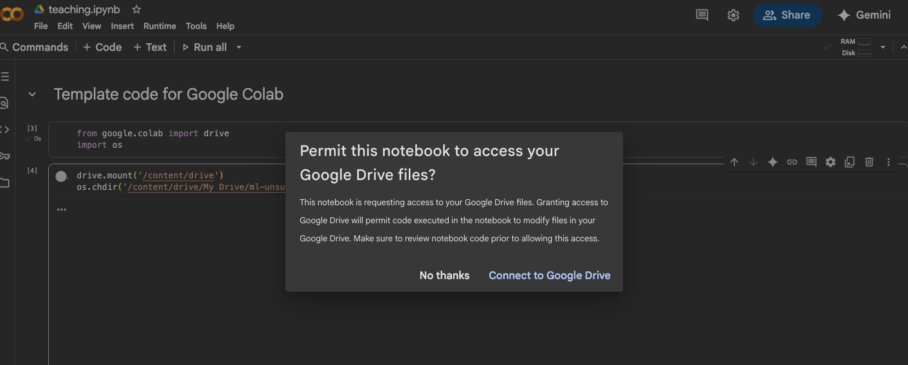
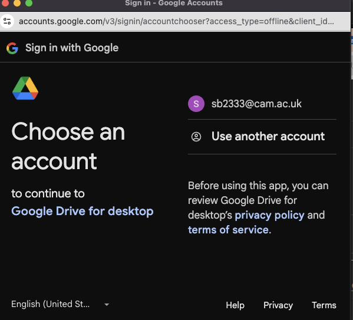
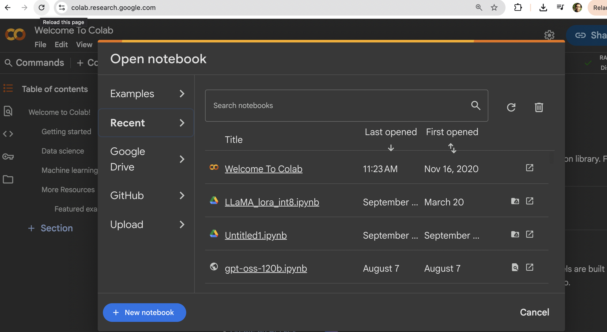
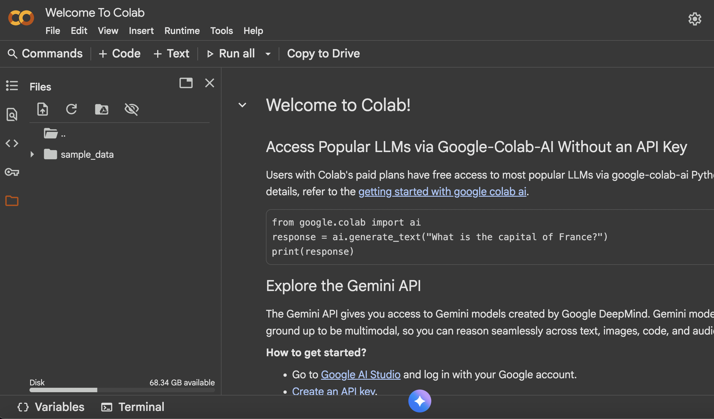
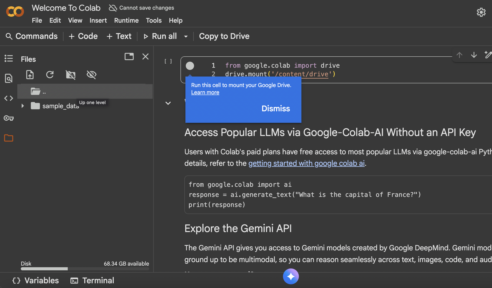
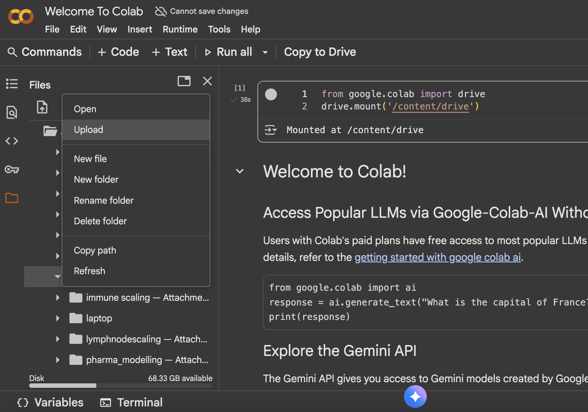

## 💾 Installation

```bash
pip install -r requirements.txt
```

### 🧠 Python Machine Learning Teaching Resource

Repository: [https://github.com/neelsoumya/python_machine_learning](https://github.com/neelsoumya/python_machine_learning)

---

### 📦 Installation Instructions (for Google Colab)

### 1. Clone the repository (optional, for full access)
```python
!git clone https://github.com/neelsoumya/python_machine_learning.git
%cd python_machine_learning
```

### 2. Install required Python packages


```python
!pip install numpy pandas keras tensorflow scikit-learn seaborn matplotlib
```

or

```python
!pip install -r requirements.txt
```


### 3. (Optional) Download specific files directly from GitHub
```python
# Example: Download a specific notebook
!wget https://raw.githubusercontent.com/neelsoumya/python_machine_learning/main/PCA_movie_ratings.ipynb
```

---

**How to use in Colab:**
- Open a new notebook in Google Colab (https://colab.research.google.com/).
- Run the above commands in code cells.
- You can now open and run any of the notebooks or scripts from the repository.

**Repository link:**  
[https://github.com/neelsoumya/python_machine_learning](https://github.com/neelsoumya/python_machine_learning)


## Data

The data used in these materials is provided as a zip file. 
Download and unzip the folder to your Desktop to follow along with the materials.

<!-- Note for Training Developers: add the link to 'href' -->
<a href="https://github.com/cambiotraining/ml-unsupervised/raw/refs/heads/main/course_files/data/data.zip">
  <button class="btn"><i class="fa fa-download"></i> Download</button>
</a>

Alternatively you can use the link below to download the data from Google Drive:

<!-- Note for Training Developers: add the link to 'href' -->
<a href="https://drive.google.com/drive/folders/1c8fYDr7ab1jUx0FwOR4NZa9RfgzZN9OQ?usp=sharing">
  <button class="btn"><i class="fa fa-download"></i> Download</button>
</a>


## Software

### 📦 Installation Instructions (for Google Colab)

<!--
>
### 1. Clone the repository (optional, for full access)
```python
!git clone https://github.com/neelsoumya/python_machine_learning.git
%cd python_machine_learning
```

### 2. Install required Python packages


```python
!pip install numpy pandas keras tensorflow scikit-learn seaborn matplotlib scanpy
```

or

```python
!pip install -r requirements.txt
```


### 3. (Optional) Download specific files directly from GitHub
```python
# Example: Download a specific notebook
!wget https://raw.githubusercontent.com/neelsoumya/python_machine_learning/main/PCA_movie_ratings.ipynb
```

---

-->

**How to use in Colab:**

- Open a new notebook in [Google Colab](https://colab.research.google.com/)

- If you want to run the notebooks in Colab, you can also use the _Open in Colab_ badge below:

[](https://colab.research.google.com)


- Run the commands in code cells.

- You can now create notebooks and run any of the scripts in Google Colab.


**Repository link:**  
[https://cambiotraining.github.io/ml-unsupervised/](https://cambiotraining.github.io/ml-unsupervised/)


* (Optional) In order to access the files on your computer, you can save them to your Google Drive (in a directory named `data`) and mount the drive in Colab. Open a new Google Colab notebook. Then create a new code cell and type the following commands (and then click the play button to run the cell):

```python
from google.colab import drive
import os
import pandas as pd

drive.mount('/content/drive')
os.chdir('/content/drive/My Drive/data')

pd.read_csv('diabetes_sample_data.csv')
```

* Google Colab will ask you to authenticate your Google account the first time you run the `drive.mount()` command. 
  Follow the instructions in the output cell to complete the authentication process. You will need a gmail account or you can use your cam.ac.uk account. Some screenshots are shown below to guide you through the process:






* If you have your files in a different directory, please change the path in the `os.chdir()` command above accordingly.

* [A template notebook](https://github.com/cambiotraining/ml-unsupervised/blob/main/course_files/data/teaching.ipynb) is also available to get you started.

* Google Colab comes with most of the required packages pre-installed. 
  If you need to install any additional packages, you can do so using the `!pip install package-name` command in a code cell.

* Create a new folder named `data` in the `My Drive` folder. Download the data files and and copy the files into the `data` folder (if you want to access the files from Colab). Your directory structure should look like this:

```
My Drive/
└─ data/
```


* (Optional) You can also follow the instructions below to setup from the browser.

* Open a new [Google Colab notebook](https://colab.research.google.com/).



* Click on the folder icon on the left-hand side to open the file explorer.



* Right-click and then mount your Google Drive and then click on the `Run this cell` button.



* Create a new folder named `data` in the `My Drive` folder. Then upload the data files into the `data` folder.




<!--
### (Optional) Setup from the browser {#browser-setup-instructions}
-->


<!--

### Quarto

To develop and render the course materials website, you will need to install _Quarto_:

- Download and install [Quarto](https://quarto.org/docs/get-started/) (available for all major OS). 
- If you are developing materials using executable `.qmd` documents, it is recommended that you also install the extensions for your favourite IDE (e.g. RStudio, VS Code).
- If you are developing materials using **JupyterLab** or **Jupyter Notebooks**, please install [Jupytext](https://jupytext.readthedocs.io/en/latest/install.html).
  - Use the [paired notebook](https://jupytext.readthedocs.io/en/latest/paired-notebooks.html) feature to have synchronised `.ipynb`/`.qmd` files. Only `.qmd` files should be pushed to the repository (`.ipynb` files have been added to `.gitignore`).

-->

<!--
### R and RStudio

::: {.tabset group="os"}

#### Windows

Download and install all these using default options:

- [R](https://cran.r-project.org/bin/windows/base/release.html)
- [RTools](https://cran.r-project.org/bin/windows/Rtools/)
- [RStudio](https://www.rstudio.com/products/rstudio/download/#download)

#### Mac OS

Download and install all these using default options:

- [R](https://cran.r-project.org/bin/macosx/)
- [RStudio](https://www.rstudio.com/products/rstudio/download/#download)

#### Linux

- Go to the [R installation](https://cran.r-project.org/bin/linux/) folder and look at the instructions for your distribution.
- Download the [RStudio](https://www.rstudio.com/products/rstudio/download/#download) installer for your distribution and install it using your package manager.

:::
-->


<!--
### Conda

Open a terminal and run:

```bash
wget -q -O - https://repo.anaconda.com/miniconda/Miniconda3-latest-Linux-x86_64.sh
bash Miniconda3-latest-Linux-x86_64.sh -b
rm Miniconda3-latest-Linux-x86_64.sh
conda init
conda config --add channels defaults; conda config --add channels bioconda; conda config --add channels conda-forge; conda config --set channel_priority strict
conda install -y mamba
```

Note: Windows users can use WSL2 (see @wsl).
-->

<!--
### Singularity

::: {.panel-tabset group="os"}

#### Windows

You can use _Singularity_ from the _Windows Subsystem for Linux_ (see @wsl).  
Once you setup WSL, you can follow the instructions for Linux.

#### Mac OS

Singularity is [not available for Mac OS](https://docs.sylabs.io/guides/3.0/user-guide/installation.html#install-on-windows-or-mac).

#### Linux

These instructions are for _Ubuntu_ or _Debian_-based distributions[^1].

[^1]: See the [Singularity documentation page](https://docs.sylabs.io/guides/3.0/user-guide/installation.html#install-on-linux) for other distributions.

```bash
sudo apt update && sudo apt upgrade && sudo apt install runc
CODENAME=$(lsb_release -c | sed 's/Codename:\t//')
wget -O singularity.deb https://github.com/sylabs/singularity/releases/download/v3.10.2/singularity-ce_3.10.2-${CODENAME}_amd64.deb
sudo dpkg -i singularity.deb
rm singularity.deb
```

:::
-->


### (Optional) Run locally {#python-setup-instructions}

* Install Python (we recommend using [Anaconda](https://www.anaconda.com/products/distribution) or [Miniconda](https://docs.conda.io/en/latest/miniconda.html) to manage your Python environment).


* Install Visual Studio Code (see below) or [Spyder](https://www.spyder-ide.org/).

<!--
* Download the [material](https://github.com/cambiotraining/ml-unsupervised/archive/refs/heads/main.zip) or from an alternative link [here](https://drive.google.com/drive/folders/1c8fYDr7ab1jUx0FwOR4NZa9RfgzZN9OQ?usp=sharing) or clone the repository (optional, for full access)

-->

<!--
```bash
git clone https://github.com/cambiotraining/ml-unsupervised
```
-->

Download the data folder from the link [here](https://drive.google.com/drive/folders/1c8fYDr7ab1jUx0FwOR4NZa9RfgzZN9OQ?usp=sharing) or unzip the file [here](https://github.com/cambiotraining/ml-unsupervised/raw/refs/heads/main/course_files/data/data.zip) and save it on your computer.

* In Terminal/Command Prompt, navigate to the folder in which you save the `data` folder. Then change directory to the `data` folder: 

```bash
cd data
```

<!-- 
```bash
cd ml-unsupervised/course_files/data
```
-->

* (Optional) Setup a virtual environment

```bash
python3 -m venv .venv
```

* Activate the virtual environment

  - On Windows (in Command Prompt):

  ```cmd
  .venv\Scripts\activate
  ```

  - On MacOS/Linux:

  ```bash
  source .venv/bin/activate
  ```  

* Install required Python packages

```python
pip install numpy pandas scikit-learn seaborn matplotlib scanpy pca
```


* If you have a local Python installation (see above), you can also run the scripts there (see instructions below). This assumes that you have downloaded and unzipped the data folder to your computer (in a folder called `data`) and that you have installed the required packages (see above).

Your directory structure should look like this:

```
data/
└─ 

```

```python
import os

# where are we?
print( os.getcwd() )

# change directory to where the data is stored
os.chdir('data/')

# where are we now?
print( os.getcwd() )
```


<!--
or

```python
pip install -r requirements.txt
```
-->

* [A template Python script](https://github.com/cambiotraining/ml-unsupervised/blob/main/course_files/data/teaching.py) is also available to get you started. 


### (Optional) Visual Studio Code

::: {.panel-tabset group="os"}

#### Windows

- Go to the [Visual Studio Code download page](https://code.visualstudio.com/Download) and download the installer for your operating system. 
  Double-click the downloaded file to install the software, accepting all the default options. 
- After completing the installation, go to your Windows Menu, search for "Visual Studio Code" and launch the application. 
- Go to "_File > Preferences > Settings_", then select "_Text Editor > Files_" on the drop-down menu on the left. Scroll down to the section named "_EOL_" and choose "_\\n_" (this will ensure that the files you edit on Windows are compatible with the Linux operating system).

#### Mac OS

- Go to the [Visual Studio Code download page](https://code.visualstudio.com/Download) and download the installer for Mac.
- Go to the Downloads folder and double-click the file you just downloaded to extract the application. Drag-and-drop the "Visual Studio Code" file to your "Applications" folder. 
- You can now open the installed application to check that it was installed successfully (the first time you launch the application you will get a warning that this is an application downloaded from the internet - you can go ahead and click "Open").

#### Linux (Ubuntu)

- Go to the [Visual Studio Code download page](https://code.visualstudio.com/Download) and download the installer for your Linux distribution. Install the package using your system's installer.

:::


<!-- 
## WSL2

There are detailed instructions on how to install WSL on the [Microsoft documentation page](https://learn.microsoft.com/en-us/windows/wsl/install). 
But briefly:

- Click the Windows key and search for  _Windows PowerShell_, right-click on the app and choose **Run as administrator**. 
- Answer "Yes" when it asks if you want the App to make changes on your computer. 
- A terminal will open; run the command: `wsl --install`. 
  - This should start installing "ubuntu". 
  - It may ask for you to restart your computer. 
- After restart, click the Windows key and search for _Ubuntu_, click on the App and it should open a new terminal. 
- Follow the instructions to create a username and password (you can use the same username and password that you have on Windows, or a different one - it's your choice). 
  - **Note:** when you type your password nothing seems to be happening as the cursor doesn't move. However, the terminal is recording your password as you type. You will be asked to type the new password again to confirm it, so you can always try again if you get it wrong the first time.
- You should now have access to a Ubuntu Linux terminal. 
  This behaves very much like a regular Ubuntu server, and you can install apps using the `sudo apt install` command as usual. 


### Configuring WSL2

After installation, it is useful to **create shortcuts to your files on Windows**. 
Your main `C:\` drive is located in `/mnt/c/` and other drives will be equally available based on their letter. 
It may be convenient to create shortcuts to commonly-used directories, which you can do using _symbolic links_. 
Here are some commands to automatically create shortcuts to your Windows "Documents",  "Desktop" and "Downloads" folders:

```bash
ln -s $(wslpath $(powershell.exe '[environment]::getfolderpath("mydocuments")')) ~/Documents
ln -s $(wslpath $(powershell.exe '[environment]::getfolderpath("desktop")')) ~/Desktop
ln -s $(wslpath $(powershell.exe '[environment]::getfolderpath("downloads")')) ~/Downloads
```

You may also want to configure the Windows terminal to automatically open _WSL2_ (instead of the default Windows Command Prompt or Powershell):

- Search for and open the "<i class="fa-solid fa-terminal"></i> Terminal" application.
- Click on the downward arrow <i class="fa-solid fa-chevron-down"></i> in the toolbar.
- Click on "<i class="fa-solid fa-gear"></i> Settings".
- Under "Default Profile" select "<i class="fa-brands fa-linux"></i> Ubuntu". 
-->

---
