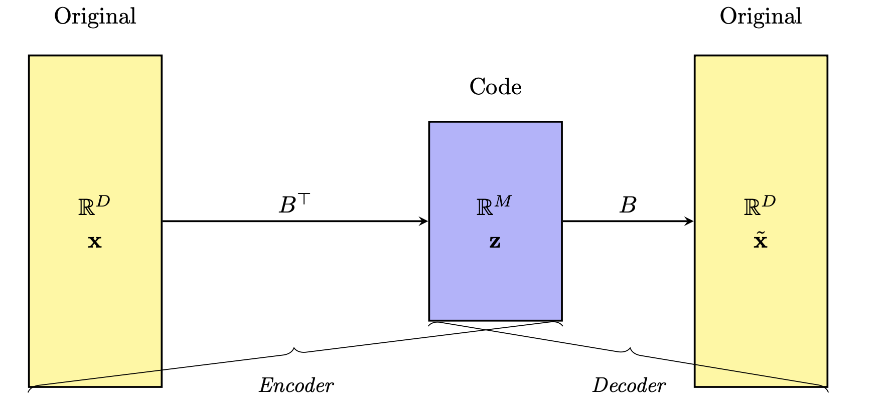

## Introduction to Unsupervised Learning

## Learning Objectives

By the end of this module, learners will be able to:

* Define unsupervised learning and explain how it differs from supervised learning in terms of inputs, outputs, and goals.

* Identify common unsupervised techniques, including clustering (e.g., k‑means, hierarchical) and dimensionality reduction (e.g., PCA), and describe when each is appropriate.

* Discuss real‑world applications of unsupervised learning, such as customer segmentation, anomaly detection, and image compression.

* Explain the role of unsupervised learning in exploratory data analysis and as a preprocessing step for downstream tasks.

* Interpret principal component analysis (PCA) intuitively, including the meaning of eigenvectors and eigenvalues, to understand how PCA finds the directions of greatest variance in data.

* Apply dimensionality reduction to a simple multivariate dataset (e.g., crime rates and population by state) to visualize high‑dimensional data in two or three dimensions.

* Differentiate unsupervised from supervised problems by examining datasets and deciding whether the task is to uncover patterns versus predict a known target variable.

* Articulate the value of unsupervised learning in uncovering hidden structure in unlabelled data and its importance as data complexity and volume grow.

## Introduction

Unsupervised learning is a branch of machine learning that deals with finding hidden patterns or intrinsic structures in data without the use of labeled responses. Unlike supervised learning, where the model learns from labeled data to predict outcomes, unsupervised learning works with input data that does not have any corresponding output variables. The primary goal is to explore the underlying structure, groupings, or features in the data.

One of the most common applications of unsupervised learning is clustering, where the algorithm groups similar data points together based on their characteristics. This is particularly useful in scenarios such as customer segmentation, anomaly detection, and image compression. Another key technique is dimensionality reduction, which aims to reduce the number of variables under consideration, making it easier to visualize and interpret large datasets.

Unsupervised learning is valuable because it can reveal insights that may not be immediately apparent, uncovering relationships and patterns that might otherwise go unnoticed. It is commonly used in exploratory data analysis and as a preprocessing step for other algorithms. As data continues to grow in complexity and volume, unsupervised learning plays a critical role in making sense of unstructured information.

### Motivation

Here is a picture I took of a pavement in Cambridge the day after Valentine's Day. Why did this picture capture my attention? The starkness of the grey pavement contrasted with the bright red rose. It may have triggered some unsupervised learning mechanism in my brain that allows me to pick anomalies!

### Resources

[PCA intuition](https://stats.stackexchange.com/questions/2691/making-sense-of-principal-component-analysis-eigenvectors-eigenvalues)

### Key Concept 

In unsupervised learning, the __bottleneck concept__ refers to a deliberate architectural constraint in a model—typically an autoencoder—where information is compressed through a narrow intermediate representation, often called a latent code or embedding. The model is trained to reconstruct the input data after passing it through this low-dimensional bottleneck, forcing it to learn a compact and informative representation of the underlying structure of the data. Since there are no labels guiding the learning process, the model relies solely on reconstructing its input as accurately as possible, using only the limited information passed through this narrow channel. This compression encourages the model to capture essential features while discarding noise or redundancy.

The bottleneck acts as an inductive bias that promotes dimensionality reduction, feature learning, and denoising. By minimizing reconstruction error while constrained by a reduced latent space, the model implicitly discovers patterns, clusters, and hierarchies within the input data. In practical terms, this is a foundational principle behind many unsupervised representation learning methods, including classical autoencoders, variational autoencoders (VAEs), and self-supervised learning systems that rely on contrastive or generative objectives. The learned low-dimensional codes can then be used for downstream tasks such as clustering, visualization (e.g., with t-SNE or PCA), or as inputs to supervised models in a semi-supervised setting.

magine you have a huge library of biological images—say, pictures of different cell types under a microscope—and you want to teach a computer to recognize patterns in those images without telling it what any of the cells are. A “bottleneck” in this context is like asking the computer to summarize each image using only a few key words instead of the entire picture. By forcing it to compress all the rich detail down to a small summary, the computer has to figure out which features—like cell shape, size, or texture—are truly important. This is similar to how a biologist might sketch a simplified diagram of a cell, highlighting its nucleus and membrane but leaving out every ribosome and microtubule.

Because the computer must recreate the original image from that stripped‑down summary, it learns to ignore random noise or unimportant quirks (like slight variations in lighting) and focus on the core characteristics shared by similar cell types. In other words, the bottleneck helps the machine discover the hidden “essence” of the data. Once you have those concise summaries, you can use them to cluster cells into groups, visualize how different cell types relate, or even feed them into a second analysis—just as you might reduce a complex DNA dataset to a handful of genetic markers before drawing a phylogenetic tree. This approach lets you explore and interpret large biological datasets more effectively, all without ever providing explicit labels.

### Example

Given the data below, how should we reduce the number of features and/or visualize it? This is an **unsupervised** machine learning problem.

| State       | Murder (per 100k) | Robbery (per 100k) | Population     |
|-------------|-------------------|--------------------|----------------|
| California  | 9.1               | 45.3               | 39,512,223     |
| Texas       | 7.8               | 38.6               | 28,995,881     |
| Florida     | 5.9               | 31.7               | 21,477,737     |
| New York    | 3.4               | 26.4               | 19,453,561     |
| Illinois    | 6.4               | 35.1               | 12,671,821     |
| Pennsylvania| 4.8               | 22.9               | 12,801,989     |

Importantly, we are not trying to predict anything. For example, say in the data below we can try to predict the number of people who moved to that state last year. This is a **supervised** machine learning problem.

| State        | Murder (per 100k) | Robbery (per 100k) | Population   | People Who Moved (per 100k) |
|--------------|-------------------|--------------------|--------------|-----------------------------|
| California   | 9.1               | 45.3               | 39,512,223   | 5,400                       |
| Texas        | 7.8               | 38.6               | 28,995,881   | 4,100                       |
| Florida      | 5.9               | 31.7               | 21,477,737   | 6,200                       |
| New York     | 3.4               | 26.4               | 19,453,561   | 3,800                       |
| Illinois     | 6.4               | 35.1               | 12,671,821   | 2,900                       |
| Pennsylvania | 4.8               | 22.9               | 12,801,989   | 2,500                       |

## What PCA does to the data

[PCA in 3D](https://github.com/neelsoumya/python_machine_learning/blob/main/pca_intro_3D_view.ipynb)

## Activity: Playable version of PCA in browser

## Lesson Summary: Introduction to Unsupervised Learning

* Basics of unsupervised learning

* Useful for visualization, outlier detection and making sense of your data if there are many features

- **What it is:** Discover hidden patterns or groupings in unlabeled data, without predicting a specific target.  
- **Key techniques:**  
  - **Clustering** (e.g. k‑means, hierarchical) for grouping similar observations  
  - **Dimensionality reduction** (e.g. PCA) for compressing and visualizing high‑dimensional data  
- **Why it matters:**  
  - Reveals structure in customer segmentation, anomaly detection, image compression, etc.  
  - Serves as exploratory analysis and preprocessing for downstream tasks  
- **Information bottleneck:** Forcing models (like autoencoders) to squeeze data through a narrow “latent code” uncovers the most essential features and removes noise  
- **Hands‑on example:** Apply PCA to crime‑and‑population data by state to project three features into two dimensions for visualization  
- **Unsupervised vs. supervised:**  
  - **Unsupervised:** No labels, focus on pattern discovery  
  - **Supervised:** With labels, focus on predicting a known outcome  

